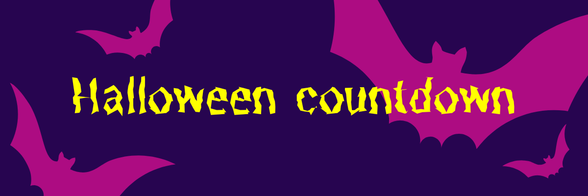

# Halloween

  

<h1 align="center">🎃 Halloween Countdown</h1>

  <a href="https://<ditt-användarnamn>.github.io/halloweenprojekt/">Live Demo</a> •
  <a href="https://github.com/<ditt-användarnamn>/halloweenprojekt">GitHub Repo</a>

A spooky countdown timer built with **HTML**, **CSS**, and **JavaScript**.  
Shows remaining days, hours, minutes, and seconds until **Halloween (October 31)**.  
Displays a 🎃 message when the countdown reaches zero.

## ✨ Features

- ⏰ Dynamic countdown updated every second
- 🎨 Custom Halloween theme with Google Fonts
- 💀 Alert message when Halloween starts
- 📱 Responsive design for mobile and desktop

## 🧰 Tech Stack

**Frontend:** HTML5, CSS3, Vanilla JavaScript  
**Deployment:** GitHub Pages  
**Tools:** Figma, VS Code, Live Server, DevTools

## 📂 Project Structure

<pre><code>halloweenprojekt/ ├─ index.html ├─ style.css ├─ script.js </code></pre>

## 🧠 Lessons Learned

- Difference between absolute and relative paths in HTML
- Filenames are case-sensitive on GitHub Pages
- Practiced Date object, DOM manipulation, and setInterval
- Learned to debug deployment issues and branch management

## 👩‍💻 Author

**<Ditt Siri Prydz>** – Frontend Developer, UX- and Graphic Designer
📧 <din.e-post@adress.se>  
🌐 [Portfolio] https://siriprydz.wixsite.com/graphicdesign | 🔗 [LinkedIn] https://www.linkedin.com/in/siriprydz/
